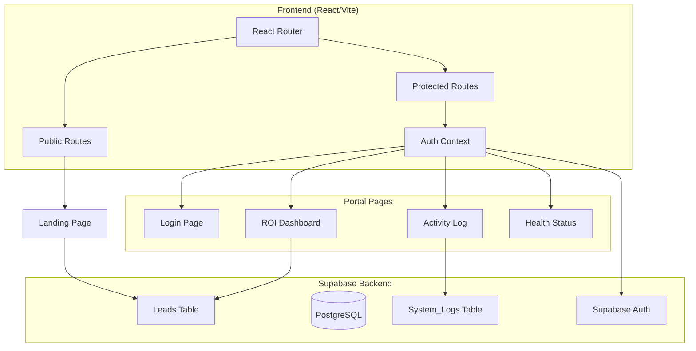

# Design Document: Growth OS Portal

## Overview

Growth OS is a client portal that provides ROI visibility, activity logging, and site health monitoring for the Fumigatron pest control website. The portal transforms the website from a "black box" into a "glass house" by giving the client real-time access to lead data, maintenance logs, and health metrics.

The implementation adds React Router for navigation, Supabase for authentication and data persistence, and three new portal screens (Dashboard, Activity, Health) behind a protected route.

## Architecture



### Route Structure

| Route | Component | Access |
|-------|-----------|--------|
| `/` | LandingPage (App.tsx) | Public |
| `/portal/login` | LoginPage | Public |
| `/portal` or `/portal/dashboard` | Dashboard | Protected |
| `/portal/activity` | ActivityLog | Protected |
| `/portal/health` | HealthStatus | Protected |

## Components and Interfaces

### Core Components

```typescript
// src/components/ProtectedRoute.tsx
interface ProtectedRouteProps {
  children: React.ReactNode;
}

// Wraps protected routes, redirects to login if unauthenticated
const ProtectedRoute: React.FC<ProtectedRouteProps>
```

```typescript
// src/context/AuthContext.tsx
interface AuthContextType {
  user: User | null;
  loading: boolean;
  signIn: (email: string, password: string) => Promise<void>;
  signOut: () => Promise<void>;
}

// Provides authentication state and methods throughout the app
const AuthContext: React.Context<AuthContextType>
```

```typescript
// src/components/portal/PortalLayout.tsx
interface PortalLayoutProps {
  children: React.ReactNode;
}

// Wraps portal pages with sidebar navigation
const PortalLayout: React.FC<PortalLayoutProps>
```

### Page Components

```typescript
// src/pages/portal/LoginPage.tsx
// Renders login form, handles authentication
const LoginPage: React.FC

// src/pages/portal/Dashboard.tsx
// Displays lead stats, pipeline value, recent leads
const Dashboard: React.FC

// src/pages/portal/ActivityLog.tsx
// Displays system logs, provides entry form
const ActivityLog: React.FC

// src/pages/portal/HealthStatus.tsx
// Displays hardcoded health metrics
const HealthStatus: React.FC
```

### Shared UI Components

```typescript
// src/components/portal/StatCard.tsx
interface StatCardProps {
  title: string;
  value: string | number;
  icon: string;
  trend?: string;
}

// src/components/portal/LeadCard.tsx
interface LeadCardProps {
  lead: Lead;
  onCall: (phone: string) => void;
}

// src/components/portal/LogEntry.tsx
interface LogEntryProps {
  log: SystemLog;
}

// src/components/portal/StatusIndicator.tsx
interface StatusIndicatorProps {
  label: string;
  status: 'good' | 'warning' | 'error';
}
```

## Data Models

### Supabase Database Schema

```sql
-- Leads table
CREATE TABLE leads (
  id UUID DEFAULT gen_random_uuid() PRIMARY KEY,
  name TEXT NOT NULL,
  phone TEXT NOT NULL,
  service TEXT NOT NULL,
  created_at TIMESTAMP WITH TIME ZONE DEFAULT NOW()
);

-- Enable RLS
ALTER TABLE leads ENABLE ROW LEVEL SECURITY;

-- Policy: Authenticated users can read all leads
CREATE POLICY "Authenticated users can read leads"
  ON leads FOR SELECT
  TO authenticated
  USING (true);

-- Policy: Anyone can insert leads (for contact form)
CREATE POLICY "Anyone can insert leads"
  ON leads FOR INSERT
  TO anon, authenticated
  WITH CHECK (true);
```

```sql
-- System logs table
CREATE TABLE system_logs (
  id UUID DEFAULT gen_random_uuid() PRIMARY KEY,
  action_type TEXT NOT NULL CHECK (action_type IN ('security', 'speed', 'content')),
  message TEXT NOT NULL,
  created_at TIMESTAMP WITH TIME ZONE DEFAULT NOW()
);

-- Enable RLS
ALTER TABLE system_logs ENABLE ROW LEVEL SECURITY;

-- Policy: Authenticated users can read logs
CREATE POLICY "Authenticated users can read logs"
  ON system_logs FOR SELECT
  TO authenticated
  USING (true);

-- Policy: Authenticated users can insert logs
CREATE POLICY "Authenticated users can insert logs"
  ON system_logs FOR INSERT
  TO authenticated
  WITH CHECK (true);
```

### TypeScript Interfaces

```typescript
// src/types/index.ts
export interface Lead {
  id: string;
  name: string;
  phone: string;
  service: string;
  created_at: string;
}

export interface SystemLog {
  id: string;
  action_type: 'security' | 'speed' | 'content';
  message: string;
  created_at: string;
}

export type ActionType = 'security' | 'speed' | 'content';

export const ACTION_TYPE_ICONS: Record<ActionType, string> = {
  security: '🛡️',
  speed: '⚡',
  content: '📝',
};
```

### Supabase Client Configuration

```typescript
// src/lib/supabase.ts
import { createClient } from '@supabase/supabase-js';

const supabaseUrl = import.meta.env.VITE_SUPABASE_URL;
const supabaseAnonKey = import.meta.env.VITE_SUPABASE_ANON_KEY;

export const supabase = createClient(supabaseUrl, supabaseAnonKey);
```

### Data Access Functions

```typescript
// src/lib/leads.ts
export async function createLead(lead: Omit<Lead, 'id' | 'created_at'>): Promise<Lead>
export async function getLeadsThisMonth(): Promise<Lead[]>
export async function getRecentLeads(limit: number): Promise<Lead[]>

// src/lib/logs.ts
export async function createLog(log: Omit<SystemLog, 'id' | 'created_at'>): Promise<SystemLog>
export async function getAllLogs(): Promise<SystemLog[]>
```


## Correctness Properties

*A property is a characteristic or behavior that should hold true across all valid executions of a system—essentially, a formal statement about what the system should do. Properties serve as the bridge between human-readable specifications and machine-verifiable correctness guarantees.*

### Property 1: Protected Route Authentication Check

*For any* protected route under `/portal/*` (excluding `/portal/login`), when accessed by an unauthenticated user, the router should redirect to `/portal/login`.

**Validates: Requirements 1.2, 1.3**

### Property 2: Invalid Credentials Error Display

*For any* login attempt with invalid credentials (wrong email or password), the authentication system should display an error message and the user should remain on the login page.

**Validates: Requirements 2.2**

### Property 3: Lead Data Integrity

*For any* valid lead submission (non-empty name, phone, and service), when saved to the database, the retrieved lead should contain the exact same name, phone, and service values, plus a valid id and created_at timestamp.

**Validates: Requirements 3.1, 3.2**

### Property 4: Lead Form Validation

*For any* form submission where at least one required field (name, phone, or service) is empty or whitespace-only, the form should prevent submission and display validation errors.

**Validates: Requirements 3.5**

### Property 5: Dashboard Metrics Calculation

*For any* set of leads in the current month, the dashboard should display the correct count and the pipeline value should equal the count multiplied by 500.

**Validates: Requirements 4.1, 4.2**

### Property 6: Recent Leads Display Completeness

*For any* lead displayed in the recent leads list, the display should include the lead's name, phone number, service type, and timestamp.

**Validates: Requirements 4.3**

### Property 7: Call Button Phone Link

*For any* lead with a phone number, the "Call" button's href attribute should be a valid `tel:` link containing that exact phone number.

**Validates: Requirements 4.4**

### Property 8: Activity Log Sorting

*For any* set of system logs, when displayed on the activity page, they should be sorted by created_at in descending order (newest first).

**Validates: Requirements 5.1**

### Property 9: Action Type Icon Mapping

*For any* system log entry, the displayed icon should match the action_type: 'security' → 🛡️, 'speed' → ⚡, 'content' → 📝.

**Validates: Requirements 5.2**

### Property 10: Log Data Integrity

*For any* valid log entry submission (valid action_type and non-empty message), when saved to the database, the retrieved log should contain the exact same action_type and message values, plus a valid id and created_at timestamp.

**Validates: Requirements 5.3, 5.4**

### Property 11: Portal Navigation Presence

*For any* authenticated portal page (dashboard, activity, health), the navigation component should be rendered and visible.

**Validates: Requirements 7.1**

### Property 12: Navigation Link Routing

*For any* navigation link in the portal sidebar, clicking it should navigate to the corresponding route (Dashboard → /portal/dashboard, Activity → /portal/activity, Health → /portal/health).

**Validates: Requirements 7.4**

### Property 13: Active Navigation State

*For any* portal route, the navigation should visually indicate which page is currently active by applying distinct styling to the corresponding nav item.

**Validates: Requirements 7.5**

## Error Handling

### Authentication Errors

| Error | Handling |
|-------|----------|
| Invalid credentials | Display "Invalid email or password" message, clear password field |
| Network error | Display "Unable to connect. Please try again." message |
| Session expired | Redirect to login with "Session expired" message |

### Database Errors

| Error | Handling |
|-------|----------|
| Lead save failure | Display "Unable to submit. Please try again." in contact form |
| Log save failure | Display "Unable to save log entry." toast notification |
| Data fetch failure | Display "Unable to load data." with retry button |

### Form Validation Errors

| Field | Validation | Error Message |
|-------|------------|---------------|
| Name | Required, non-empty | "Name is required" |
| Phone | Required, non-empty | "Phone number is required" |
| Service | Required, must select | "Please select a service type" |
| Action Type | Required, valid enum | "Please select an action type" |
| Message | Required, non-empty | "Message is required" |

## Testing Strategy

### Unit Tests

Unit tests should cover specific examples and edge cases:

- Login form renders correctly
- Dashboard displays zero state when no leads exist
- Health page displays all hardcoded values correctly
- Navigation links have correct href attributes
- Form validation shows correct error messages for each field

### Property-Based Tests

Property-based tests should verify universal properties using a library like `fast-check`:

- **Minimum 100 iterations per property test**
- Each test should reference its design document property
- Tag format: **Feature: growth-os-portal, Property {number}: {property_text}**

Property tests to implement:
1. Protected route redirect (Property 1)
2. Lead data round-trip integrity (Property 3)
3. Form validation rejection (Property 4)
4. Dashboard metrics calculation (Property 5)
5. Call button tel: link format (Property 7)
6. Log sorting order (Property 8)
7. Action type icon mapping (Property 9)
8. Log data round-trip integrity (Property 10)

### Integration Tests

Integration tests should verify Supabase interactions:

- Lead creation and retrieval
- Log creation and retrieval
- Authentication flow (login/logout)
- RLS policy enforcement

### Test Configuration

```typescript
// vitest.config.ts additions
export default defineConfig({
  test: {
    environment: 'jsdom',
    setupFiles: ['./src/test/setup.ts'],
    coverage: {
      reporter: ['text', 'json', 'html'],
    },
  },
});
```

```typescript
// Property test example structure
import { fc } from 'fast-check';

describe('Feature: growth-os-portal', () => {
  it('Property 5: Dashboard Metrics Calculation', () => {
    fc.assert(
      fc.property(
        fc.array(fc.record({ /* lead shape */ })),
        (leads) => {
          const count = leads.length;
          const expectedPipeline = count * 500;
          // Assert dashboard displays correct values
        }
      ),
      { numRuns: 100 }
    );
  });
});
```
