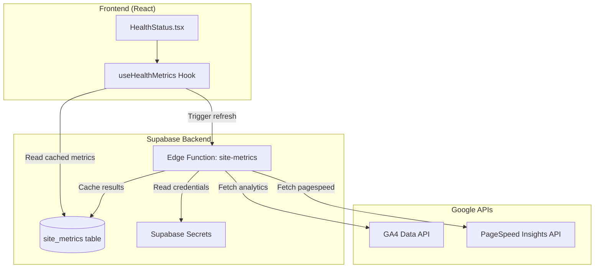

# Design Document: Real Health Metrics

## Overview

This design describes the integration of Google Analytics Data API (GA4) and Google PageSpeed Insights API into the Growth OS portal's Health Status page. The architecture uses Supabase Edge Functions as a secure backend layer to call Google APIs while keeping credentials safe, and caches results in a Supabase table to minimize API calls and stay within free tier limits.

The solution follows a cache-first pattern: the frontend reads cached metrics from Supabase, and a manual refresh button (or scheduled job) triggers fresh API calls through the edge function.

## Architecture



### Data Flow

1. **Page Load**: HealthStatus component calls `useHealthMetrics` hook
2. **Cache Read**: Hook queries `site_metrics` table for cached data
3. **Display**: Component renders metrics with last_updated timestamps
4. **Manual Refresh**: User clicks refresh → hook invokes edge function
5. **API Calls**: Edge function fetches from Google APIs using secrets
6. **Cache Update**: Edge function upserts results into `site_metrics`
7. **UI Update**: Hook re-fetches and component re-renders

## Components and Interfaces

### 1. Database: site_metrics Table

```sql
CREATE TABLE site_metrics (
  id UUID DEFAULT gen_random_uuid() PRIMARY KEY,
  metric_type TEXT NOT NULL UNIQUE,
  metric_value JSONB NOT NULL,
  last_updated TIMESTAMP WITH TIME ZONE DEFAULT NOW()
);
```

**Metric Types and Values:**

```typescript
// metric_type: 'analytics'
interface AnalyticsMetric {
  currentMonthSessions: number;
  previousMonthSessions: number;
  percentChange: number;
  fetchedAt: string; // ISO timestamp
}

// metric_type: 'pagespeed'
interface PageSpeedMetric {
  mobileScore: number;      // 0-100
  desktopScore: number;     // 0-100
  sslEnabled: boolean;
  fetchedAt: string;        // ISO timestamp
}
```

### 2. Edge Function: site-metrics

**Location:** `supabase/functions/site-metrics/index.ts`

**Interface:**

```typescript
// Request body
interface SiteMetricsRequest {
  action: 'get-metrics' | 'fetch-analytics' | 'fetch-pagespeed';
}

// Response
interface SiteMetricsResponse {
  success: boolean;
  data?: {
    analytics?: AnalyticsMetric;
    pagespeed?: PageSpeedMetric;
  };
  error?: string;
}
```

**Required Secrets:**
- `GOOGLE_SERVICE_ACCOUNT_JSON` - Service account credentials for GA4
- `GA4_PROPERTY_ID` - Google Analytics property ID
- `PAGESPEED_API_KEY` - PageSpeed Insights API key
- `SITE_URL` - The URL to analyze (e.g., https://fumigatron.com)

### 3. React Hook: useHealthMetrics

**Location:** `src/hooks/useHealthMetrics.ts`

```typescript
interface UseHealthMetricsReturn {
  analytics: AnalyticsMetric | null;
  pagespeed: PageSpeedMetric | null;
  isLoading: boolean;
  error: string | null;
  lastUpdated: {
    analytics: Date | null;
    pagespeed: Date | null;
  };
  refreshAnalytics: () => Promise<void>;
  refreshPagespeed: () => Promise<void>;
  isRefreshing: {
    analytics: boolean;
    pagespeed: boolean;
  };
}
```

### 4. Updated HealthStatus Component

**Location:** `src/pages/portal/HealthStatus.tsx`

The component will be updated to:
- Use `useHealthMetrics` hook instead of hardcoded values
- Display loading skeletons while fetching
- Show last updated timestamps
- Include refresh buttons for each metric section
- Map scores to status colors (green/yellow/red)

### 5. Score Status Utility

**Location:** `src/utils/healthScoreStatus.ts`

```typescript
type HealthStatus = 'good' | 'warning' | 'poor';

interface ScoreStatus {
  status: HealthStatus;
  label: string;
  color: string;
}

function getScoreStatus(score: number): ScoreStatus;
function getSslStatus(enabled: boolean): ScoreStatus;
```

## Data Models

### Site Metrics Table Schema

| Column | Type | Constraints | Description |
|--------|------|-------------|-------------|
| id | UUID | PRIMARY KEY, DEFAULT gen_random_uuid() | Unique identifier |
| metric_type | TEXT | NOT NULL, UNIQUE | Type: 'analytics' or 'pagespeed' |
| metric_value | JSONB | NOT NULL | Metric data as JSON |
| last_updated | TIMESTAMPTZ | DEFAULT NOW() | Last cache update time |

### Analytics Metric Value Structure

```json
{
  "currentMonthSessions": 1240,
  "previousMonthSessions": 1078,
  "percentChange": 15.03,
  "fetchedAt": "2024-01-15T10:30:00Z"
}
```

### PageSpeed Metric Value Structure

```json
{
  "mobileScore": 92,
  "desktopScore": 98,
  "sslEnabled": true,
  "fetchedAt": "2024-01-15T10:30:00Z"
}
```

### TypeScript Interfaces

```typescript
// Database row type
interface SiteMetricRow {
  id: string;
  metric_type: 'analytics' | 'pagespeed';
  metric_value: AnalyticsMetric | PageSpeedMetric;
  last_updated: string;
}

// Analytics data from GA4 API
interface AnalyticsMetric {
  currentMonthSessions: number;
  previousMonthSessions: number;
  percentChange: number;
  fetchedAt: string;
}

// PageSpeed data from PSI API
interface PageSpeedMetric {
  mobileScore: number;
  desktopScore: number;
  sslEnabled: boolean;
  fetchedAt: string;
}

// Combined metrics for frontend
interface HealthMetrics {
  analytics: AnalyticsMetric | null;
  pagespeed: PageSpeedMetric | null;
}
```


## Correctness Properties

*A property is a characteristic or behavior that should hold true across all valid executions of a system—essentially, a formal statement about what the system should do. Properties serve as the bridge between human-readable specifications and machine-verifiable correctness guarantees.*

### Property 1: Percentage Change Calculation

*For any* two non-negative session counts (current and previous), where previous is greater than zero, the calculated percentage change SHALL equal `((current - previous) / previous) * 100`, rounded to two decimal places.

**Validates: Requirements 2.3**

### Property 2: Score to Status Mapping

*For any* numeric score in the range 0-100, the `getScoreStatus` function SHALL return:
- `{ status: 'good', label: 'Excelente' }` when score >= 90
- `{ status: 'warning', label: 'Necesita mejoras' }` when 50 <= score < 90
- `{ status: 'poor', label: 'Crítico' }` when score < 50

**Validates: Requirements 5.5, 6.1, 6.2, 6.3, 6.6**

### Property 3: Metric Storage Round-Trip

*For any* valid metric object (analytics or pagespeed), storing it in the Site_Metrics_Table and then retrieving it by metric_type SHALL return an equivalent object with matching values.

**Validates: Requirements 1.4, 4.4**

### Property 4: Edge Function Response Structure Invariant

*For any* call to the Edge Function (regardless of action or success/failure), the response SHALL contain exactly the fields `{ success: boolean, data?: object, error?: string }` where `success: true` implies `data` is present and `success: false` implies `error` is present.

**Validates: Requirements 4.5, 4.6, 2.5, 3.5**

### Property 5: Analytics Data Parsing

*For any* valid GA4 API response containing session metrics, the parsing function SHALL extract `currentMonthSessions` and `previousMonthSessions` as non-negative integers, and the resulting `percentChange` SHALL be calculated correctly per Property 1.

**Validates: Requirements 2.1, 2.2, 2.4**

### Property 6: PageSpeed Data Parsing

*For any* valid PageSpeed Insights API response, the parsing function SHALL extract `mobileScore` and `desktopScore` as integers in range 0-100, and `sslEnabled` as a boolean derived from the analyzed URL protocol.

**Validates: Requirements 3.1, 3.2, 3.3, 3.4**

### Property 7: Valid Metric Types Only

*For any* attempt to store a metric with an invalid metric_type (not 'analytics' or 'pagespeed'), the operation SHALL be rejected or fail validation.

**Validates: Requirements 1.2**

## Error Handling

### Edge Function Errors

| Error Scenario | Response | Frontend Behavior |
|----------------|----------|-------------------|
| Invalid action parameter | `{ success: false, error: "Invalid action" }` | Show error toast |
| GA4 API authentication failure | `{ success: false, error: "GA4 auth failed" }` | Show "Configure Analytics" message |
| GA4 API rate limit | `{ success: false, error: "Rate limited" }` | Show cached data with warning |
| PageSpeed API failure | `{ success: false, error: "PageSpeed unavailable" }` | Show cached data or fallback |
| Database write failure | `{ success: false, error: "Cache update failed" }` | Return stale data, log error |
| Missing secrets | `{ success: false, error: "Configuration missing" }` | Show setup instructions |

### Frontend Error States

1. **No cached data + API error**: Display "No data available" with setup instructions
2. **Stale cached data + API error**: Display cached data with "Last updated X ago" warning
3. **Refresh failure**: Keep current data, show error toast, enable retry
4. **Network error**: Show offline indicator, disable refresh buttons

### Graceful Degradation

- If analytics fails, pagespeed can still display (and vice versa)
- Each metric section operates independently
- Cached data always preferred over showing errors
- Clear messaging about data freshness

## Testing Strategy

### Unit Tests

Unit tests focus on specific examples and edge cases:

1. **Score Status Mapping**
   - Test boundary values: 0, 49, 50, 89, 90, 100
   - Test SSL status for true/false

2. **Percentage Calculation**
   - Test with zero previous (edge case - should handle gracefully)
   - Test with equal values (0% change)
   - Test with negative change

3. **API Response Parsing**
   - Test with minimal valid response
   - Test with missing fields
   - Test with malformed data

### Property-Based Tests

Property tests use a library like `fast-check` to verify universal properties across many generated inputs. Each test runs minimum 100 iterations.

**Test Configuration:**
- Library: `fast-check` (TypeScript)
- Minimum iterations: 100 per property
- Tag format: `Feature: real-health-metrics, Property N: [description]`

**Property Tests to Implement:**

1. **Feature: real-health-metrics, Property 1: Percentage change calculation**
   - Generate random pairs of (current, previous) session counts
   - Verify formula correctness

2. **Feature: real-health-metrics, Property 2: Score to status mapping**
   - Generate random scores 0-100
   - Verify correct status assignment for all thresholds

3. **Feature: real-health-metrics, Property 3: Metric storage round-trip**
   - Generate random valid metric objects
   - Store and retrieve, verify equality

4. **Feature: real-health-metrics, Property 4: Response structure invariant**
   - Generate various edge function inputs
   - Verify response always has correct structure

### Integration Tests

1. **Edge Function Integration**
   - Mock Google APIs
   - Verify complete fetch-and-cache flow
   - Verify get-metrics returns cached data

2. **Frontend Integration**
   - Mock Supabase client
   - Verify hook fetches and exposes data correctly
   - Verify refresh triggers edge function

### Test File Structure

```
src/
├── utils/
│   └── __tests__/
│       └── healthScoreStatus.test.ts    # Unit + Property tests
├── hooks/
│   └── __tests__/
│       └── useHealthMetrics.test.ts     # Hook tests
supabase/
└── functions/
    └── site-metrics/
        └── __tests__/
            └── index.test.ts            # Edge function tests
```

