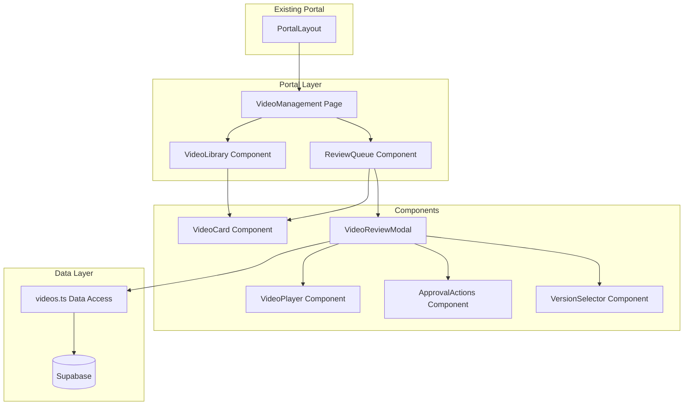

# Design Document: Video Management

## Overview

The Video Management feature implements a "Quality Control Gate" for marketing video approvals within the Growth OS client portal. It provides a structured workflow replacing chaotic WhatsApp-based approvals with a professional, trackable system that reinforces the connection between marketing efforts and lead generation.

The design follows the existing portal architecture patterns, integrating seamlessly with PortalLayout, using Supabase for data persistence, and maintaining visual consistency with Dashboard, ActivityLog, and HealthStatus pages.

### Key Design Decisions

1. **Single Page with Tab Views**: Rather than multiple routes, the feature uses a single `/portal/videos` route with internal tab navigation (Review Queue / Library) to keep the experience focused
2. **Modal-based Video Review**: Video playback and approval actions happen in a modal overlay to maintain context of the queue
3. **Objective-First Display**: Strategic context is prominently displayed to guide approval decisions based on business goals
4. **Optimistic UI Updates**: Approval actions update the UI immediately while persisting to Supabase in the background

## Architecture



### Component Hierarchy

```
VideoManagement (Page)
├── Header (title, description)
├── TabNavigation (Review Queue | Library)
├── ReviewQueue (tab content)
│   ├── StatCard (pending count)
│   └── VideoCard[] (pending videos)
├── VideoLibrary (tab content)
│   ├── StatCard (library count)
│   ├── ObjectiveFilter
│   └── VideoCard[] (approved videos)
└── VideoReviewModal (overlay)
    ├── VideoPlayer
    ├── VersionSelector
    ├── ObjectiveDisplay
    └── ApprovalActions
```

## Components and Interfaces

### Page Component

```typescript
// src/pages/portal/VideoManagement.tsx
interface VideoManagementProps {}

// Internal state
type TabView = 'queue' | 'library';
```

### VideoCard Component

```typescript
// src/components/portal/VideoCard.tsx
interface VideoCardProps {
  video: Video;
  onClick: (video: Video) => void;
}
```

Displays video thumbnail, title, objective badge, and date. Follows LeadCard styling patterns with hover effects.

### VideoReviewModal Component

```typescript
// src/components/portal/VideoReviewModal.tsx
interface VideoReviewModalProps {
  video: Video;
  versions: VideoVersion[];
  onClose: () => void;
  onApprove: (videoId: string) => Promise<void>;
  onRequestRevision: (videoId: string, feedback: string) => Promise<void>;
  onReject: (videoId: string, reason: string) => Promise<void>;
}
```

Full-screen modal with video player, version selector, objective display, and approval action buttons.

### VideoPlayer Component

```typescript
// src/components/portal/VideoPlayer.tsx
interface VideoPlayerProps {
  videoUrl: string;
  thumbnailUrl?: string;
}
```

HTML5 video player with standard controls. Supports MP4, WebM, MOV formats.

### ApprovalActions Component

```typescript
// src/components/portal/ApprovalActions.tsx
interface ApprovalActionsProps {
  status: ApprovalStatus;
  approvedAt?: string;
  onApprove: () => void;
  onRequestRevision: (feedback: string) => void;
  onReject: (reason: string) => void;
  disabled?: boolean;
}
```

Three-button layout: Approve (green), Request Revision (yellow), Reject (red). Shows approval date if already approved.

### ObjectiveDisplay Component

```typescript
// src/components/portal/ObjectiveDisplay.tsx
interface ObjectiveDisplayProps {
  objective: VideoObjective;
  size?: 'sm' | 'md' | 'lg';
}

// Objective configuration
const OBJECTIVE_CONFIG: Record<VideoObjective, { label: string; icon: string; color: string }> = {
  trust_building: { label: 'Construir Confianza', icon: 'handshake', color: 'blue' },
  lead_generation: { label: 'Generar Leads', icon: 'trending_up', color: 'green' },
  brand_awareness: { label: 'Reconocimiento de Marca', icon: 'campaign', color: 'purple' },
  service_showcase: { label: 'Mostrar Servicios', icon: 'home_repair_service', color: 'orange' },
};
```

### VersionSelector Component

```typescript
// src/components/portal/VersionSelector.tsx
interface VersionSelectorProps {
  versions: VideoVersion[];
  selectedVersion: string;
  onVersionChange: (versionId: string) => void;
}
```

Dropdown or pill selector for switching between video versions.

## Data Models

### TypeScript Types

```typescript
// src/types/index.ts (additions)

export type VideoObjective = 'trust_building' | 'lead_generation' | 'brand_awareness' | 'service_showcase';

export type ApprovalStatus = 'pending' | 'approved' | 'rejected' | 'revision_requested';

export interface Video {
  id: string;
  title: string;
  objective: VideoObjective;
  status: ApprovalStatus;
  video_url: string;
  thumbnail_url: string;
  created_at: string;
  approved_at?: string;
}

export interface VideoVersion {
  id: string;
  video_id: string;
  version_number: number;
  video_url: string;
  created_at: string;
}

export interface VideoFeedback {
  id: string;
  video_id: string;
  feedback_type: 'revision_request' | 'rejection';
  message: string;
  created_at: string;
}

export const OBJECTIVE_LABELS: Record<VideoObjective, string> = {
  trust_building: 'Construir Confianza',
  lead_generation: 'Generar Leads',
  brand_awareness: 'Reconocimiento de Marca',
  service_showcase: 'Mostrar Servicios',
};

export const OBJECTIVE_ICONS: Record<VideoObjective, string> = {
  trust_building: 'handshake',
  lead_generation: 'trending_up',
  brand_awareness: 'campaign',
  service_showcase: 'home_repair_service',
};
```

### Database Schema

```sql
-- supabase/migrations/002_video_management.sql

-- Videos table
CREATE TABLE IF NOT EXISTS videos (
  id UUID DEFAULT gen_random_uuid() PRIMARY KEY,
  title TEXT NOT NULL,
  objective TEXT NOT NULL CHECK (objective IN ('trust_building', 'lead_generation', 'brand_awareness', 'service_showcase')),
  status TEXT NOT NULL DEFAULT 'pending' CHECK (status IN ('pending', 'approved', 'rejected', 'revision_requested')),
  video_url TEXT NOT NULL,
  thumbnail_url TEXT NOT NULL,
  created_at TIMESTAMP WITH TIME ZONE DEFAULT NOW(),
  approved_at TIMESTAMP WITH TIME ZONE
);

-- Video versions table
CREATE TABLE IF NOT EXISTS video_versions (
  id UUID DEFAULT gen_random_uuid() PRIMARY KEY,
  video_id UUID NOT NULL REFERENCES videos(id) ON DELETE CASCADE,
  version_number INTEGER NOT NULL,
  video_url TEXT NOT NULL,
  created_at TIMESTAMP WITH TIME ZONE DEFAULT NOW(),
  UNIQUE(video_id, version_number)
);

-- Video feedback table
CREATE TABLE IF NOT EXISTS video_feedback (
  id UUID DEFAULT gen_random_uuid() PRIMARY KEY,
  video_id UUID NOT NULL REFERENCES videos(id) ON DELETE CASCADE,
  feedback_type TEXT NOT NULL CHECK (feedback_type IN ('revision_request', 'rejection')),
  message TEXT NOT NULL,
  created_at TIMESTAMP WITH TIME ZONE DEFAULT NOW()
);

-- Enable RLS
ALTER TABLE videos ENABLE ROW LEVEL SECURITY;
ALTER TABLE video_versions ENABLE ROW LEVEL SECURITY;
ALTER TABLE video_feedback ENABLE ROW LEVEL SECURITY;

-- Policies
CREATE POLICY "Authenticated users can read videos"
  ON videos FOR SELECT TO authenticated USING (true);

CREATE POLICY "Authenticated users can update videos"
  ON videos FOR UPDATE TO authenticated USING (true);

CREATE POLICY "Authenticated users can read video_versions"
  ON video_versions FOR SELECT TO authenticated USING (true);

CREATE POLICY "Authenticated users can read video_feedback"
  ON video_feedback FOR SELECT TO authenticated USING (true);

CREATE POLICY "Authenticated users can insert video_feedback"
  ON video_feedback FOR INSERT TO authenticated WITH CHECK (true);

-- Indexes
CREATE INDEX IF NOT EXISTS idx_videos_status ON videos(status);
CREATE INDEX IF NOT EXISTS idx_videos_objective ON videos(objective);
CREATE INDEX IF NOT EXISTS idx_videos_created_at ON videos(created_at DESC);
CREATE INDEX IF NOT EXISTS idx_video_versions_video_id ON video_versions(video_id);
```

### Data Access Functions

```typescript
// src/lib/videos.ts

import { supabase } from './supabase';
import { Video, VideoVersion, VideoFeedback, ApprovalStatus } from '../types';

export async function getPendingVideos(): Promise<Video[]> {
  const { data, error } = await supabase
    .from('videos')
    .select('*')
    .eq('status', 'pending')
    .order('created_at', { ascending: false });

  if (error) throw error;
  return data || [];
}

export async function getApprovedVideos(): Promise<Video[]> {
  const { data, error } = await supabase
    .from('videos')
    .select('*')
    .eq('status', 'approved')
    .order('approved_at', { ascending: false });

  if (error) throw error;
  return data || [];
}

export async function getVideoVersions(videoId: string): Promise<VideoVersion[]> {
  const { data, error } = await supabase
    .from('video_versions')
    .select('*')
    .eq('video_id', videoId)
    .order('version_number', { ascending: false });

  if (error) throw error;
  return data || [];
}

export async function approveVideo(videoId: string): Promise<Video> {
  const { data, error } = await supabase
    .from('videos')
    .update({ 
      status: 'approved' as ApprovalStatus, 
      approved_at: new Date().toISOString() 
    })
    .eq('id', videoId)
    .select()
    .single();

  if (error) throw error;
  return data;
}

export async function requestVideoRevision(videoId: string, feedback: string): Promise<Video> {
  // Insert feedback
  const { error: feedbackError } = await supabase
    .from('video_feedback')
    .insert({ video_id: videoId, feedback_type: 'revision_request', message: feedback });

  if (feedbackError) throw feedbackError;

  // Update status
  const { data, error } = await supabase
    .from('videos')
    .update({ status: 'revision_requested' as ApprovalStatus })
    .eq('id', videoId)
    .select()
    .single();

  if (error) throw error;
  return data;
}

export async function rejectVideo(videoId: string, reason: string): Promise<Video> {
  // Insert feedback
  const { error: feedbackError } = await supabase
    .from('video_feedback')
    .insert({ video_id: videoId, feedback_type: 'rejection', message: reason });

  if (feedbackError) throw feedbackError;

  // Update status
  const { data, error } = await supabase
    .from('videos')
    .update({ status: 'rejected' as ApprovalStatus })
    .eq('id', videoId)
    .select()
    .single();

  if (error) throw error;
  return data;
}

export function serializeVideo(video: Video): string {
  return JSON.stringify(video);
}

export function deserializeVideo(json: string): Video {
  const parsed = JSON.parse(json);
  // Validate required fields
  if (!parsed.id || !parsed.title || !parsed.objective || !parsed.status) {
    throw new Error('Invalid video data structure');
  }
  return parsed as Video;
}
```


## Correctness Properties

*A property is a characteristic or behavior that should hold true across all valid executions of a system—essentially, a formal statement about what the system should do. Properties serve as the bridge between human-readable specifications and machine-verifiable correctness guarantees.*

### Property 1: Status Filtering Returns Correct Videos

*For any* set of videos with various statuses, filtering by a specific status (pending or approved) SHALL return exactly and only the videos with that status.

**Validates: Requirements 1.1, 4.1**

### Property 2: Video Display Contains Required Fields

*For any* video object, the rendered VideoCard component SHALL contain the video's title, objective label, thumbnail, and relevant date (created_at for pending, approved_at for approved).

**Validates: Requirements 1.2, 2.2, 4.2, 5.1**

### Property 3: Pending Videos Ordered by Date

*For any* list of pending videos returned by getPendingVideos(), the videos SHALL be ordered by created_at in descending order (newest first).

**Validates: Requirements 1.4**

### Property 4: Version Selector for Multi-Version Videos

*For any* video with more than one version, the VideoReviewModal SHALL display a version selector. *For any* video with exactly one version, the version selector SHALL be hidden or disabled.

**Validates: Requirements 2.3**

### Property 5: Approve Action State Transition

*For any* video with status 'pending', calling approveVideo() SHALL change the status to 'approved' AND set approved_at to a valid timestamp.

**Validates: Requirements 3.1**

### Property 6: Revision Request State Transition

*For any* video with status 'pending' and *any* non-empty feedback string, calling requestVideoRevision() SHALL change the status to 'revision_requested' AND create a video_feedback record with the provided message.

**Validates: Requirements 3.2**

### Property 7: Reject Action State Transition

*For any* video with status 'pending' and *any* non-empty reason string, calling rejectVideo() SHALL change the status to 'rejected' AND create a video_feedback record with the provided reason.

**Validates: Requirements 3.3**

### Property 8: Approved Videos Immutable

*For any* video with status 'approved', attempting to change the status SHALL either fail or be prevented by the UI (approval actions disabled).

**Validates: Requirements 3.4**

### Property 9: Library Count Accuracy

*For any* set of videos, the library count displayed SHALL equal the exact number of videos with status 'approved'.

**Validates: Requirements 4.4**

### Property 10: Serialization Round-Trip

*For any* valid Video object, serializing with serializeVideo() then deserializing with deserializeVideo() SHALL produce an object equivalent to the original.

**Validates: Requirements 6.5, 6.6**

## Error Handling

### Network Errors

- Display error toast/banner when Supabase operations fail
- Maintain current UI state on failure (don't clear data)
- Provide retry option for failed operations
- Log errors for debugging

### Invalid Data

- Validate video URLs before attempting playback
- Handle missing thumbnails with placeholder image
- Gracefully handle videos with no versions (show current video only)
- Validate feedback/reason is non-empty before submission

### Loading States

- Show spinner during initial data fetch (consistent with Dashboard pattern)
- Show inline loading indicator during approval actions
- Disable action buttons while operations are in progress

### Empty States

- Review Queue: "No hay videos pendientes. ¡Todo está al día!"
- Video Library: "Tu biblioteca está vacía. Los videos aprobados aparecerán aquí."

## Testing Strategy

### Unit Tests

Unit tests focus on specific examples, edge cases, and error conditions:

1. **Component Rendering**
   - VideoCard renders with all required fields
   - ObjectiveDisplay shows correct label and icon for each objective type
   - ApprovalActions shows correct buttons based on status
   - Empty states render correctly

2. **Edge Cases**
   - Video with no versions
   - Video with empty title (validation)
   - Invalid objective type handling
   - Malformed JSON in deserializeVideo

3. **Error Conditions**
   - Network failure during approval
   - Invalid video ID
   - Empty feedback submission attempt

### Property-Based Tests

Property-based tests verify universal properties across all inputs. Each test runs minimum 100 iterations.

**Testing Library**: fast-check (TypeScript property-based testing library)

**Test Configuration**:
```typescript
import fc from 'fast-check';

// Minimum 100 iterations per property
const testConfig = { numRuns: 100 };
```

**Property Test Implementation**:

Each correctness property from the design document MUST be implemented as a single property-based test with the following tag format:

```typescript
// Feature: video-management, Property 1: Status Filtering Returns Correct Videos
test.prop([videoListArbitrary, statusArbitrary], testConfig)('status filtering returns correct videos', ...);

// Feature: video-management, Property 10: Serialization Round-Trip
test.prop([videoArbitrary], testConfig)('serialization round-trip', (video) => {
  const serialized = serializeVideo(video);
  const deserialized = deserializeVideo(serialized);
  expect(deserialized).toEqual(video);
});
```

### Test File Structure

```
src/
├── lib/
│   └── __tests__/
│       └── videos.test.ts          # Data access unit tests
│       └── videos.property.test.ts # Property-based tests
├── components/
│   └── portal/
│       └── __tests__/
│           └── VideoCard.test.tsx  # Component unit tests
```

### Arbitraries (Test Data Generators)

```typescript
// Test data generators for property-based tests
const videoObjectiveArbitrary = fc.constantFrom(
  'trust_building', 'lead_generation', 'brand_awareness', 'service_showcase'
);

const approvalStatusArbitrary = fc.constantFrom(
  'pending', 'approved', 'rejected', 'revision_requested'
);

const videoArbitrary = fc.record({
  id: fc.uuid(),
  title: fc.string({ minLength: 1, maxLength: 100 }),
  objective: videoObjectiveArbitrary,
  status: approvalStatusArbitrary,
  video_url: fc.webUrl(),
  thumbnail_url: fc.webUrl(),
  created_at: fc.date().map(d => d.toISOString()),
  approved_at: fc.option(fc.date().map(d => d.toISOString()), { nil: undefined }),
});

const videoListArbitrary = fc.array(videoArbitrary, { minLength: 0, maxLength: 50 });
```
